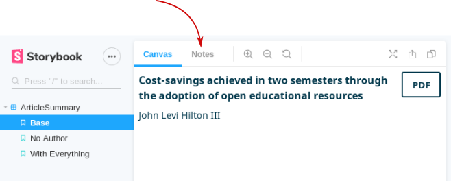

# Theme Component Library

A [storybook](https://github.com/storybookjs/storybook) to help build, test and document UI components to be used in themes for [Open Journal Systems](https://github.com/pkp/ojs).

## Setup

Install the dependencies.

```
npm run install
```

Run the storybook.

```
npm run storybook
```

Your web browser should open to the component library and you can begin exploring the component stories.

## Notes

The notes for each component contain critical information on accessibility requirements, usability guidance and device compatibility. These should be read carefully and followed whenever implementing a component in a theme.



## Contributing

Please file issues at our [main project repository](https://github.com/pkp/pkp-lib/issues/). Pull requests should be opened against this repository.